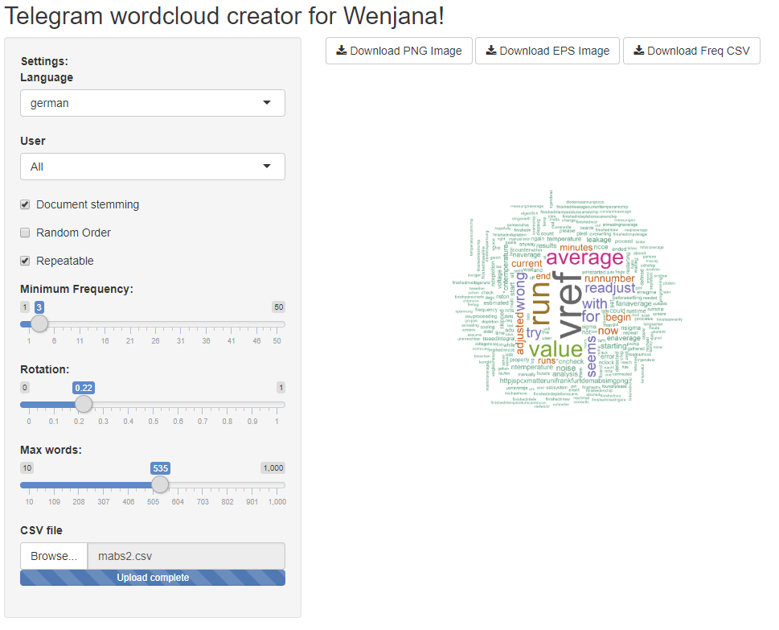

# Telegram wordcloud creator



This is a tool to create a cool wordcloud out of your telegram chat history.
Use [Telegram message dump](https://github.com/Kosat/telegram-messages-dump) to generate the needed csv file for input. 

[Use directly this tool online](https://benlinnik.shinyapps.io/telegramcloudanalysis/)

# Instructions

1. Download the dumper executable from [here](https://github.com/Kosat/telegram-messages-dump/releases)
2. Run the executable from a command line with the following options:

```
.\telegram-messages-dump.exe --chat="<Name as seen in telegram>" -p +123456789012 -l 4000 -o ChatHistory.csv -e="csv"
```
If the export process freezes, reduce the "-l 4000" message limit option to some lower value like 1000. Theoretically the "-l 0" option should dump all messages, but for some reason it freezes.

3. Start the downloaded R Shiny tool and import the generated CSV file. AN example file from a laboratory bot of mine is provided with this tool. Alternatively use my [hosted version](https://benlinnik.shinyapps.io/telegramcloudanalysis/)
4. Dow load the generated wordcloud as an EPS (vector) image for printing
5. Be creative with and suprise your loved one.

# Credits

App inspired by [TrigonaMinimas app](https://github.com/TrigonaMinima/shiny_apps/tree/master/wordcloud)

See also my LaTex and document wordcloud [generator](https://github.com/BenLinnik/BigDocumentAnalysis) for a more general purpose wordcloud tool.
